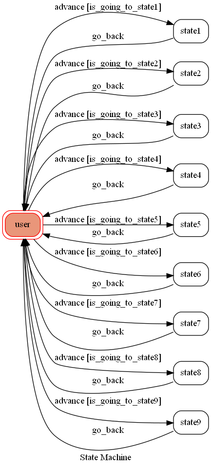

# TOC Project 2020

Code for TOC Project 2020

A Line bot based on a finite state machine

## Finite State Machine

## Usage
The initial state is set to `user`.

Every time `user` state is triggered to `advance` to another state, it will `go_back` to `user` state after the bot replies corresponding message.

* user
	* Input: "日常","戰鬥","劇情","戀愛","穿越","科幻","音樂","熱血"
		* Reply: "推薦的內容以及載體"

	* Input: "預覽"
		* Reply: "推薦內容的預覽圖"
		
    * Input: "show-fsm"
		* Reply: "fsm.png"
